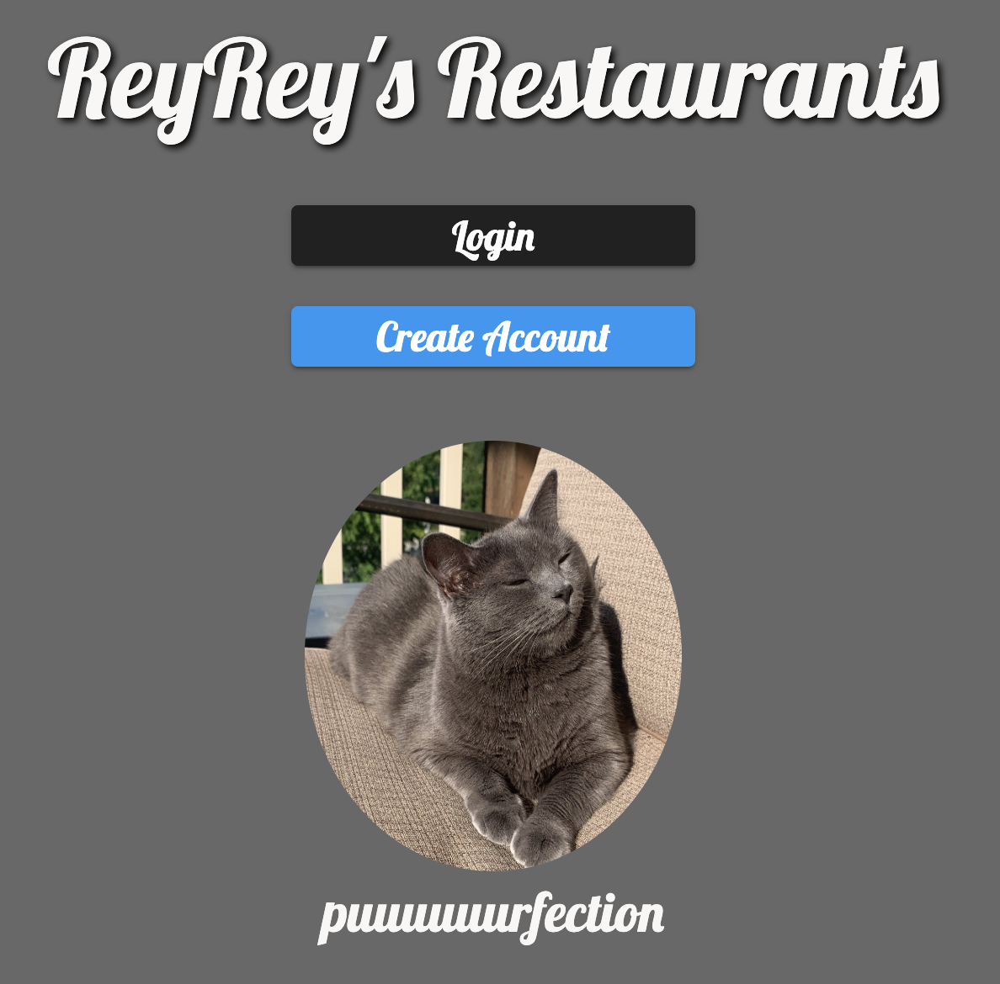

# Reyrey's Restaurants

Welcome to the Reyrey's Restaurants guide!

Do you live somewhere with a lot of great restaurants? Would you like a way to track where you've been and recommend places to your friends?

ReyRey can help!

This project enables you to save places you want to go (in the "wanna-go" category) area. I built it in celebration of my cat (ReyRey), as well as just for fun to track our local restaurants.

When you've visited one of your restaurants "promote" it to "been-there."

All while being helped by ReyRey!

This project is Open Source and makes use of Angular, Firebase, AngularFire2, Jest for unit testing, and Bootstrap.

Hope you enjoyed the app, feel free to connect with me on Twitter at [@AndrewEvans0102](https://twitter.com/andrewevans0102) for more info!

